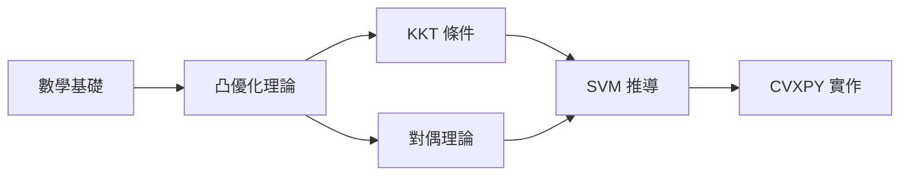
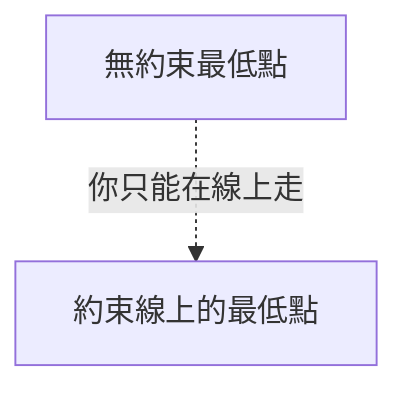
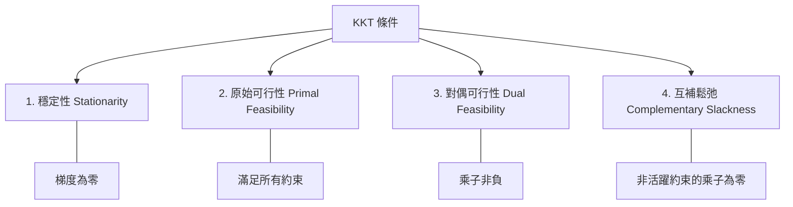
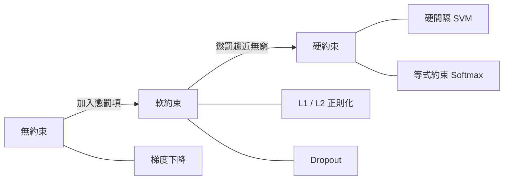
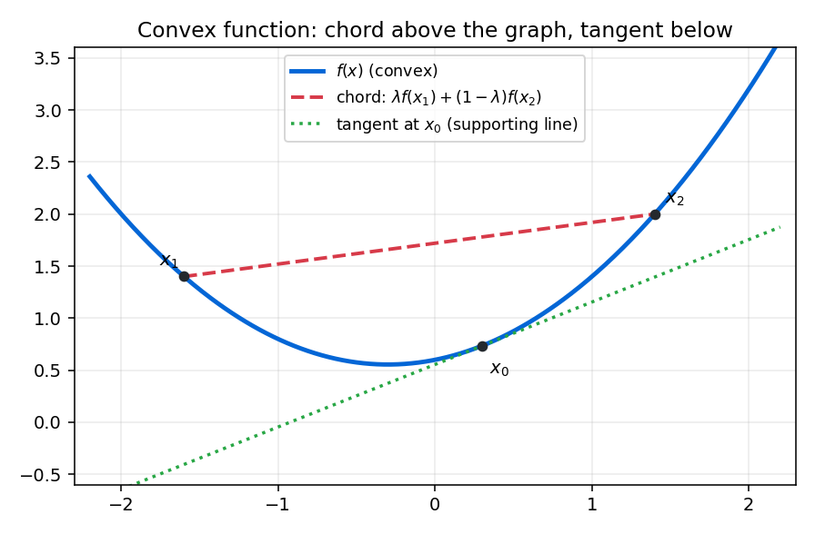

# 🗺️ 約束優化理論與機器學習

> **無約束到有約束的距離，就是理論到現實的距離。**
> 
> 本篇筆記將從幾何直覺出發，探討約束優化的數學核心，並展示其在現代機器學習中的應用。
> 本文參考了 [Stephen Boyd 的《Convex Optimization》](https://web.stanford.edu/~boyd/cvxbook/) 以及 [Wikipedia: Karush-Kuhn-Tucker conditions](https://en.wikipedia.org/wiki/Karush%E2%80%93Kuhn%E2%80%93Tucker_conditions)。

---

## 📋 學習任務清單

- [x] 理解無約束與有約束優化的幾何差異
- [x] 掌握拉格朗日乘子法 (Lagrange Multiplier)
- [ ] 深入對偶理論與 KKT 條件
- [ ] 實作 ~~邏輯迴歸~~ **SVM (Support Vector Machine)**，體會約束的威力
- [ ] 延伸閱讀
    - [ ] [CVXPY 官方教學](https://www.cvxpy.org/tutorial/index.html)
    - [ ] [scikit-learn SVM 文件](https://scikit-learn.org/stable/modules/svm.html)

---

## 📍 一、約束地圖 Roadmap

| 層次 | 主題 | 核心問題 | 學習重點 | 
|:---:|:---|:---|:---|
| **第一層** | 數學基礎 | 理解幾何語言 | 向量空間、梯度、Hessian。 | 
| **第二層** | 凸優化理論 | 怎麼保證找到的答案可信？ | 凸集與凸函數、KKT 條件、對偶理論。 | 
| **第三層** | 機器學習應用 | 這些理論在實際工具裡怎麼出現？ | SVM 完整推導、貝葉斯視角的正則化。 | 
| **第四層** | 動手實作 | 理解是否真的紮實 | 從零實作帶約束的優化、用 `CVXPY` 解 SVM。 | 

下圖為整體學習路線的依賴關係：



---

## 🎯 二、約束的數學出發點

### 1. 從最基本的問題開始

數學中最核心的問題之一就是**無約束優化 (Unconstrained Optimization)**：

$$
\min_x f(x)
$$

只要找到滿足 $\nabla f(x) = 0$ 的點，通常就是我們要的答案。

然而，現實世界幾乎從來不是這樣的。現實問題都帶著條件：
1. 「在預算不超過 100 萬的情況下，最大化工廠產能」
2. 「在機率總和等於 1 的條件下，找到最優分布」

---

### 這就引出了**約束優化** 的核心數學形式：

$$
\begin{aligned}
\min_x \quad & f(x) \\
\text{subject to} \quad & g(x) \leq 0, \\
& h(x) = 0
\end{aligned}
$$

其中各符號的意義如下：

- $f(x)$：**目標函數** (Objective Function)，我們想要最小化的對象
- $g(x) \leq 0$：**不等式約束** (Inequality Constraint)
    - 例如：預算限制、資源上限
    - 在幾何上，定義了一個「可行域」
- $h(x) = 0$：**等式約束** (Equality Constraint)
    - 例如：機率總和為 1
    - 在幾何上，定義了一條「可行曲面」

---

## 2. 幾何直覺：為什麼「約束」改變了一切？

* **無約束情況**：站在無邊無際的山丘上，目標是找到最低點。只要沿著**最陡的下坡 (Negative Gradient)** 方向走就好了。
* **有約束情況**：地上畫了一條線，你只能在這條線上移動。你要找的是「這條線上的最低點」。



📌 **關鍵理論**：在這個「線上的最低點」上，$f(x)$ 的梯度方向必定和約束線的方向**垂直**。

---

## 🛠️ 三、核心求解工具

### 1. 拉格朗日乘子法 (Lagrange Multiplier)

為解決等式約束問題：$\min_x f(x) \quad \text{subject to} \quad h(x) = 0$

在最優點 $x^*$，幾何特性可以用梯度語言表達：
$$
\nabla f(x^*) = -\lambda \cdot \nabla h(x^*)
$$

將其整合進一個新函數，稱為**拉格朗日函數 (Lagrangian)**：
$$
\mathcal{L}(x, \lambda) = f(x) + \lambda \cdot h(x)
$$

> $\lambda$ 就像是約束的「影子價格」。$\lambda$ 越大，這個約束越「值錢」。

### 2. KKT 條件 (Karush-Kuhn-Tucker)

當問題同時包含等式與不等式約束時，最優解必須滿足以下**四個條件**：



數學形式如下：

| 條件 | 數學表達 | 直覺意義 |
|:---|:---|:---|
| Stationarity | $\nabla f + \sum \mu_i \nabla g_i + \sum \lambda_j \nabla h_j = 0$ | 所有力量在最優點平衡 |
| Primal Feasibility | $g_i(x) \leq 0, \quad h_j(x) = 0$ | 解必須在可行域內 |
| Dual Feasibility | $\mu_i \geq 0$ | 不等式約束的乘子非負 |
| Complementary Slackness | $\mu_i \cdot g_i(x) = 0$ | 約束要嘛緊繃、要嘛乘子為零 |

---

## 🤖 四、約束與機器學習的超級連接

整個機器的訓練過程，本質上是一個巨大的優化問題。當我們加入約束時：

| 機器學習工具 | 數學形式概念 | 對應優化概念 |
|:---|:---|:---|
| **L2 正則化 (Ridge)** | $\min \mathcal{L} + \lambda\|\mathbf{w}\|_2^2$ | 軟約束（懲罰函數） |
| **Max-Norm Constraint** | $\min \mathcal{L}$ s.t. $\|\mathbf{w}\| \leq c$ | 硬不等式約束（KKT） |
| **Softmax 機率輸出** | $\sum \hat{y}_i = 1$ | 硬等式約束（Lagrange） |
| **硬間隔 SVM** | $\min \frac{1}{2}\|\mathbf{w}\|^2$ s.t. $y_i(\mathbf{w}^T x_i + b) \geq 1$ | KKT 條件 |

> **結論**：所有機器學習中的約束工具，都是將「帶著枷鎖找最低點」轉化成「找一個更大系統的駐點」！

---

## 🧪 五、動手實作：用 CVXPY 解 SVM

以下示範如何使用 Python 的 [CVXPY](https://www.cvxpy.org/) 套件，以凸優化的方式求解一個簡單的線性 SVM：

```python
import numpy as np
import cvxpy as cp

# 產生二分類資料
np.random.seed(42)
X_pos = np.random.randn(20, 2) + np.array([2, 2])
X_neg = np.random.randn(20, 2) + np.array([-2, -2])
X = np.vstack([X_pos, X_neg])
y = np.hstack([np.ones(20), -np.ones(20)])

# 定義變數
n_samples, n_features = X.shape
w = cp.Variable(n_features)
b = cp.Variable()

# 硬間隔 SVM：min 0.5 * ||w||^2  s.t. y_i(w^T x_i + b) >= 1
objective = cp.Minimize(0.5 * cp.norm(w, 2) ** 2)
constraints = [cp.multiply(y, X @ w + b) >= 1]

prob = cp.Problem(objective, constraints)
prob.solve()

print(f"最優權重 w = {w.value}")
print(f"最優偏差 b = {b.value:.4f}")
print(f"間隔寬度 = {2 / np.linalg.norm(w.value):.4f}")
```

執行結果會輸出最優的超平面參數，以及兩類之間的最大間隔寬度。

若想改用 `scikit-learn` 驗證，只需幾行：

```python
from sklearn.svm import SVC

clf = SVC(kernel="linear", C=1e6)  # C 很大 ≈ 硬間隔
clf.fit(X, y)
print(f"sklearn w = {clf.coef_}")
print(f"sklearn b = {clf.intercept_}")
```

---

## 📊 六、從軟約束到硬約束：一張圖看懂

下圖整理了從「無約束」到「硬約束」的光譜，以及各自在機器學習中的代表工具：



---

## 📚 七、延伸資源

以下是學習約束優化與機器學習的推薦資源：

- **教科書**
    - [Convex Optimization — Boyd & Vandenberghe](https://web.stanford.edu/~boyd/cvxbook/) — 免費線上全文，約束優化的聖經級教材
    - [Pattern Recognition and Machine Learning — Bishop](https://www.microsoft.com/en-us/research/publication/pattern-recognition-machine-learning/) — 機器學習的貝葉斯視角
- **線上課程**
    - [Stanford EE364a: Convex Optimization](https://web.stanford.edu/class/ee364a/) — Boyd 親授，含完整講義與作業
    - [MIT 6.036: Introduction to Machine Learning](https://openlearninglibrary.mit.edu/courses/course-v1:MITx+6.036+1T2019/about) — 涵蓋 SVM 與正則化
- **實作工具文件**
    - [CVXPY Documentation](https://www.cvxpy.org/) — Python 凸優化建模框架
    - [NumPy Documentation](https://numpy.org/doc/) — 數值計算基礎
    - [scikit-learn SVM Guide](https://scikit-learn.org/stable/modules/svm.html) — SVM 實作指南

---

## 💡 結語

> 約束優化不只是一門數學工具，它是**理解現代機器學習為何能運作**的底層語言。
> 
> 從拉格朗日乘子法到 KKT 條件，從對偶理論到 SVM，每一步都是在回答同一個問題：
> **「在有限的條件下，如何做到最好？」**


> 延伸視覺化參考：[Wikipedia — Convex Function 圖解](https://en.wikipedia.org/wiki/Convex_function)